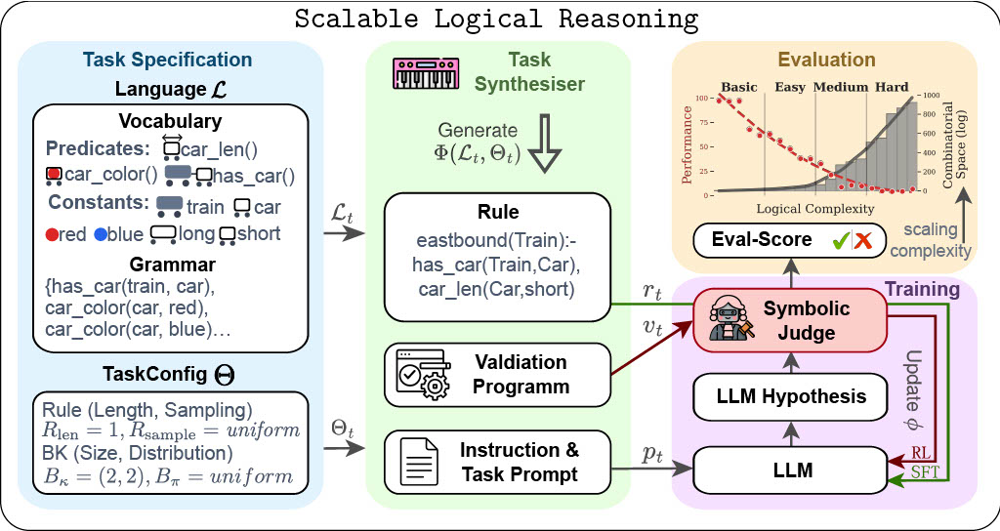
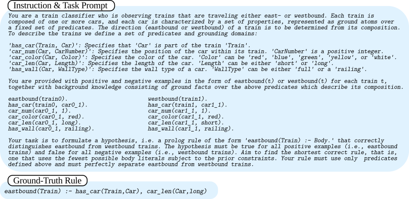
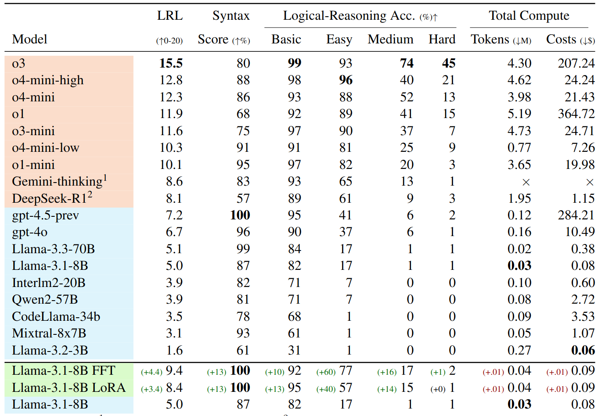

# SLR: Scalable Logical Reasoning for Large Language Models

> **Note:** Source code will be released soon! Dataset, evaluators, and instructions will follow shortly.

---

## Overview

**SLR** (*Scalable Logical Reasoning*) is an open-source framework for synthesizing, evaluating, and training Large Language Models (LLMs) on verifiable, scalable inductive reasoning tasks. Given a user-defined task specification, SLR synthesizes custom logic tasks of precisely tuned complexity and enables symbolic, annotation-free evaluation, making it an extensible platform for probing and improving the reasoning skills of LLMs.

  

*SLR: End-to-end pipeline for logic task generation, deterministic symbolic evaluation, and logic-based LLM training.*

---

## Key Features

- 🔨 **Automatic Task Generation:** Synthesize new inductive reasoning tasks with controllable complexity, novel logic rules, and natural language prompts—no need for human annotation.
- 🧩 **Programmable & Scalable:** Specify your own logic vocabulary, grammar, rule distributions, and task parameters; supports curriculum-style scaling and out-of-distribution task creation.
- 🧠 **Symbolic, Automated Evaluation:** Deterministically verify LLM outputs via the validation program, not MCQA, LLM judge, or exact matching.
- 📈 **Curriculum Learning:** Use SLR-Bench, a structured 20-level benchmark, for evaluating and training models across a span of logical challenges.

---

## SLR-Bench: Benchmarking Reasoning at Scale

We instantiate SLR as **SLR-Bench**, an automatically generated reasoning benchmark for LLMs. SLR-Bench comprises 19,000+ prompts spanning 20 curriculum levels, from simple attribute lookups to advanced relational, arithmetic, and recursive tasks.

  

*SLR-Bench: As logic complexity rises, model accuracy drops—exposing limits of contemporary LLMs and creating new challenges for future models.*

---

## How It Works

### 1. **Task Specification**
- **Define a language**: List constants, predicates, and functional vocabulary with type/arity constraints.
- **Configure task generation**: Set rule complexity, sampling policy, background knowledge distributions, and example count.

### 2. **Task Synthesis**
- **Rule Synthesis**: Auto-generates a hidden ground-truth rule (randomly or LLM-guided) as the underlying hypothesis.
- **Background/Label Generation**: Samples background atoms and labels queries through symbolic execution for positive/negative examples.
- **Prompt Construction**: Outputs NL instruction prompts for the task.
- **Reproducibility & Novelty**: Remove data leakage by guaranteeing no task/rule/test overlap with pretraining.

  

*Example: SLR-generated prompt and target rule (Level 1, SLR-Bench)*

### 3. **Training & Evaluation**
- **Symbolic Judge**: Deterministically verifies candidate LLM solutions by logic execution, providing both full-task and per-example scoring.
- **Supervised and RL Training**: Enables logic-tuning with ground-truth rules (SFT) or RL with verifiable feedback.

---

## Results & Benchmarks

Below: SLR-Bench leaderboard (v0.1). Reasoning LLMs (e.g., OpenAI's o3) outperform base models, but incur massive test-time compute costs. Logic-tuned models (e.g., Llama-3-8B-FFT with SLR data) achieve strong gains at a tiny fraction of compute.

  

---

## Why SLR?

- **Extensible**: Swap in new logical vocabularies, grammars, or task domains without rewriting code.
- **Verifiable**: No more MCQA guessing, hidden dataset contamination, or ambiguous grading. All evaluation is automated, symbolic, and fully reproducible.
- **Scalable**: Automatically generate train/test datasets of arbitrary size or complexity—without annotation bottlenecks or data overlap with LLM pretraining.
- **Model-Agnostic**: Works with both open and closed LLMs, and is compatible with SFT, RL, or other training loops.

---

## Getting Started

**Code Coming Soon!**  
Planned for first release:
- SLR-Bench dataset and splits (prompts, labels, ground truths, evaluator)
- End-to-end synthesizer and scorer
- Examples for model evaluation, curriculum-based finetuning
- Documentation and easy extensibility templates

---

## Citation

If you use SLR or SLR-Bench in your work, please cite:

> [Full citation and arXiv link once paper is public]

---

## License

This repository is released under the MIT License.

---

### Contact

Questions or suggestions? Open an issue or reach out via [slr-project.github.io](https://slr-project.github.io) or [email – placeholder].

---

## Acknowledgements

We thank members of the broader LLM and logic programming community for insightful discussions and evaluation feedback.
