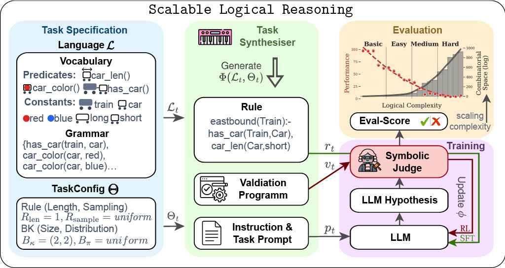
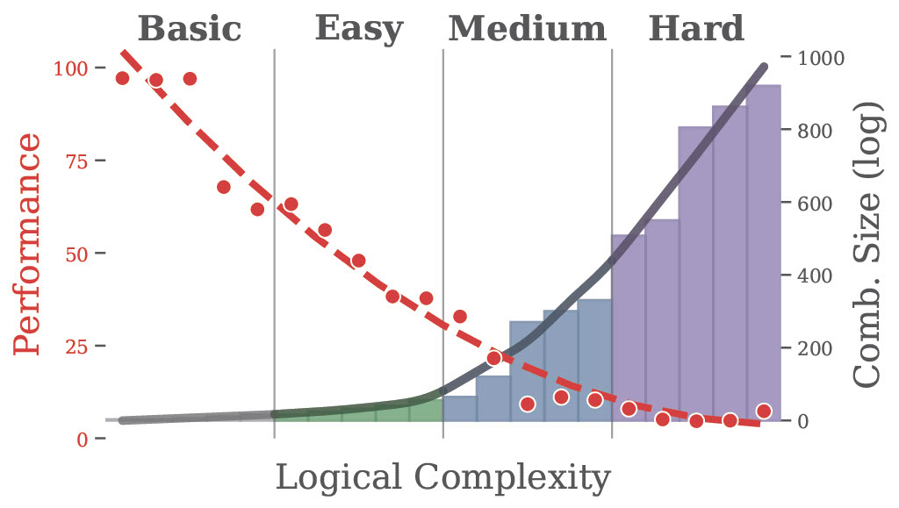
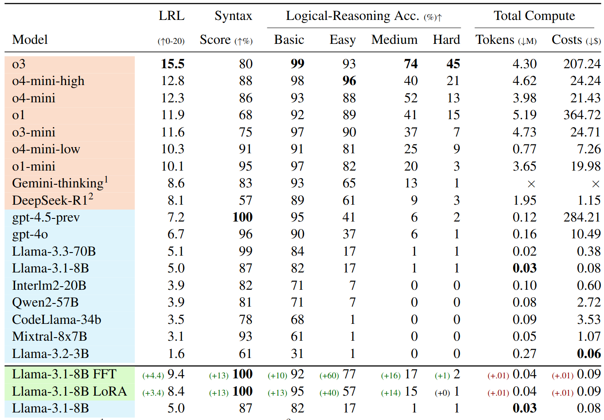

# SLR: Automated Synthesis for Scalable Logical Reasoning [ACL 2026]

[](https://huggingface.co/datasets/AIML-TUDA/SLR-Bench)
[](https://huggingface.co/spaces/AIML-TUDA/slr-leaderboard)
[](https://arxiv.org/abs/2506.15787)
[](LICENSE)

**SLR** (*Scalable Logical Reasoning*) is an end-to-end framework for systematic evaluation and training of Large Language Models (LLMs) through Scalable Logical Reasoning. Given a user’s task specification, SLR enables scalable, automated synthesis of inductive reasoning tasks with precisely controlled difficulty. For each task, SLR generates (i) a latent ground-truth rule, (ii) an executable validation program for deterministic, symbolic evaluation, and (iii) an instruction prompt for the reasoning task.
With SLR, we introduce SLR-Bench—a benchmark of over 19,000 prompts across 20 curriculum levels, progressively increasing in relational, arithmetic, and recursive complexity. Large-scale evaluation shows that while modern LLMs can produce syntactically valid rules, they often struggle with correct logical inference. Recent reasoning-focused LLMs perform better but require much more compute, sometimes exceeding 15,000 completion tokens.
Logic-tuning with SLR doubles Llama-3-8B’s accuracy on SLR-Bench, matching Gemini-Flash-Thinking at a fraction of the computational cost. SLR is fully automated, requires no human annotation, ensures dataset novelty, and provides a scalable environment for advancing LLM reasoning capabilities.


## Variants and related releases
 
**→ Multilingual versions of SLR-Bench:**
 
[](https://huggingface.co/datasets/AIML-TUDA/SLR-Bench)
[](https://huggingface.co/datasets/AIML-TUDA/SLR-Bench-German)
[](https://huggingface.co/datasets/AIML-TUDA/SLR-Bench-Spanish)
[](https://huggingface.co/datasets/AIML-TUDA/SLR-Bench-French)
[](https://huggingface.co/datasets/AIML-TUDA/SLR-Bench-Portuguese)
[](https://huggingface.co/datasets/AIML-TUDA/SLR-Bench-Italian)
[](https://huggingface.co/datasets/AIML-TUDA/SLR-Bench-Dutch)
 
**→ Out-of-distribution, evaluate on a different SLR task:**
 
[](https://huggingface.co/datasets/AIML-TUDA/SLR-Homes) 
 
**→ Use SLR to detect Reward Hacking in LLMs:**

[](https://github.com/ml-research/llms-gaming-verifiers)
[](https://arxiv.org/abs/2604.15149)

**→ Check-out HF Evaluators:**

[](https://huggingface.co/spaces/AIML-TUDA/VerifiableRewardsForScalableLogicalReasoning)
[](https://huggingface.co/spaces/AIML-TUDA/IsomorphicPerturbationTesting)


## Quick start SLR-Bench

### Loading the Dataset
```python
from datasets import load_dataset
# Load SLR-Bench test split
ds = load_dataset("AIML-TUDA/SLR-Bench", "v1-All", split="test")
```
### Evaluate using SLR-Bench
Requires the [`evaluate`](https://huggingface.co/docs/evaluate/) library and a Prolog interpreter installed on your system (e.g., [SWI-Prolog](https://www.swi-prolog.org/)).
Install the required dependencies via:

```bash
pip install evaluate
sudo apt-get install swi-prolog
```

#### Example Usage

```python
from evaluate import load
symbolic_judge = load("AIML-TUDA/VerifiableRewardsForScalableLogicalReasoning")
rules = ds["ground-truth rule"]  # For demo only—use model predictions in practice
references = [
    {
        "validation_program": p,
        "evaluation_config": {
            "positive_predicate": "eastbound",
            "negative_predicate": "westbound"
        }
    } for p in ds["validation program"]
]

results = symbolic_judge.compute(predictions=rules, references=references)
print(results)
```

*Note: For real evaluation, replace `rules` with your model's predicted rules. Here, we use ground-truth rules for demonstration only.*


---


- 🔨 **Automatic Task Generation:** Synthesize new inductive reasoning tasks with controllable complexity, novel logic rules, and natural language prompts—no need for human annotation.
- 🧩 **Programmable & Scalable:** Specify your own logic vocabulary, grammar, rule distributions, and task parameters; supports curriculum-style scaling and out-of-distribution task creation.
- 🧠 **Symbolic, Automated Evaluation:** Deterministically verify LLM outputs via the validation program, not MCQA, LLM judge, or exact matching.
- 📈 **Curriculum Learning:** Use SLR-Bench, a structured 20-level benchmark, for evaluating and training models across a span of logical challenges.
<p align="center">
  
</p>

*SLR: End-to-end pipeline for logic task generation, deterministic symbolic evaluation, and logic-based LLM training.*

---


## SLR-Bench: Benchmarking Reasoning at Scale

We instantiate SLR as **SLR-Bench**, an automatically generated reasoning benchmark for LLMs. SLR-Bench comprises 19,000+ prompts spanning 20 curriculum levels, from simple attribute lookups to advanced relational, arithmetic, and recursive tasks.

<p align="center">
  
</p>

*SLR-Bench: As logic complexity rises, model accuracy drops—exposing limits of contemporary LLMs and creating new challenges for future models.*


Below is the leaderboard for various LLMs on SLR-Bench (V0.1):
<p align="center">

</p>

*Reasoning LLMs outperform base LLMs on logical accuracy but incur much higher compute requirements. Logic-tuning with SLR dramatically boosts performance for base models at low cost.*

---

## SLR: Automatic Benchmark Synthesis

SLR enables fully automated, systematic generation of diverse and challenging logical reasoning benchmarks—directly as natural language prompts, with model outputs evaluated symbolically. The SLR synthesizer produces three outputs for each task:

1. **Latent ground-truth rule** \(R^\star\): The underlying logical rule to be discovered.
2. **Validation program**: An executable logic program encoding the background (B), positive (E⁺) and negative (E⁻) examples for automatic, symbolic evaluation.
3. **Instruction prompt**: A natural language or Prolog-style prompt presenting the task, ready for LLM input.

This pipeline allows researchers and practitioners to automate the creation of customized large, diverse, and curriculum-structured benchmarks for evaluating and training LLMs on symbolic reasoning tasks.

### Defining a Custom Logic Domain

To synthesize new benchmarks, you must specify the logical domain using several key data structures:

  **1. `identifiers` (mandatory):**
  Defines the main object and subobject types, the relation between them, and the task labels. This dictionary is required for every domain and ensures the framework can generate and interpret logical structures correctly.

  - `object_identifier`: The main entity type (e.g., "Train").
  - `subobject_identifier`: The sub-entity type (e.g., "Car").
  - `super_to_sub_predicate`: The predicate linking main objects to subobjects (e.g., "has_car").
  - `subobject_numerating_predicate` (optional but highly recommended): Use this if your subobjects have a natural order or numbering (e.g., "car_num"). Setting this is crucial for tasks where the structure or order of subobjects matters, such as mirror or symmetry-based tasks. If not set, subobject numbers may be assigned randomly, which can lead to ambiguous or incorrect behavior in such cases.
  - `positive_label` / `negative_label`: The target classification labels for the reasoning task.

  **2. `predicates`:**
  Lists all predicates in the domain and their arity (number of arguments). This defines the logical vocabulary available for rule synthesis and background generation.

  **3. `predicate_arg_types`:**
  Specifies the argument types for each predicate, mapping each argument to a domain type. This ensures that only semantically valid groundings are generated.

  **4. `constants`:**
  Enumerates all constants for each type in the domain (objects, subobjects, attributes, etc.). This provides the set of possible values for each argument type.

  **5. `validate_grounding` (as grammar):**
  A function that encodes domain-specific logical constraints, restricting which predicate groundings are valid. For example, you can enforce that only short cars have two wheels, or that passenger cars cannot have payloads. This function is passed to the `Grammar` class and is essential for generating only meaningful and consistent data.

  Below is a full example for the Train/Car domain:

```python
identifiers = {
  "object_identifier": "Train",
  "subobject_identifier": "Car",
  "super_to_sub_predicate": "has_car",
  "subobject_numerating_predicate": "car_num", # Optional: Set this if you want subobject numbers (e.g. car_num) to be assigned in ascending order and each to have an unique value instead of a random one
  "positive_label": "eastbound",
  "negative_label": "westbound"
}
predicates = {
  'has_car': 2,
  'car_num': 2,
  'car_color': 2,
  'car_len': 2,
  'has_wall': 2,
  'has_roof': 2,
  'has_wheel': 2,
  'has_payload': 2,
  'load_num': 2,
  'has_window': 2,
  'car_type': 2,
  'passenger_num': 2,
}
predicate_arg_types = {
  'has_car': ['Train', 'Car'],
  'car_num': ['Car', 'Car_number'],
  'car_color': ['Car', 'Color'],
  'car_len': ['Car', 'Length'],
  'has_wall': ['Car', 'Wall_type'],
  'has_roof': ['Car', 'Roof_type'],
  'has_wheel': ['Car', 'Number_of_wheels'],
  'has_payload': ['Car', 'Load_shape'],
  'load_num': ['Car', 'Number_of_payloads'],
  'has_window': ['Car', 'Window_type'],
  'car_type': ['Car', 'Car_Type'],
  'passenger_num': ['Car', 'Number_of_passengers'],
}
constants = {
  'Train': ['train0', 'train1'],
  'Car': ['car0_1', 'car0_2', 'car1_1', 'car1_2'],
  'Car_number': [1, 2],
  'Color': ['red', 'blue', 'green', 'yellow', 'white'],
  'Length': ['long', 'short'],
  'Wall_type': ['full', 'railing'],
  'Roof_type': ['roof_foundation', 'solid_roof', 'braced_roof', 'peaked_roof', 'none'],
  'Number_of_wheels': [2, 3],
  'Load_shape': ['blue_box', 'golden_vase', 'barrel', 'diamond', 'metal_pot', 'oval_vase', 'none'],
  'Number_of_payloads': [0, 1, 2, 3],
  'Window_type': ['full', 'half', 'none'],
  'Car_Type': ['passenger', 'freight', 'mixed'],
  'Number_of_passengers': list(range(0, 11)),
}

# Logical constraints for valid predicate groundings (example: only has_wheel=2 for short cars)
def validate_grounding(map_predicate_value: dict, predicate: str, value: str) -> bool:
  if map_predicate_value.get('car_len') == 'short':
    if predicate == 'has_wheel' and value != 2:
      return False
    if predicate == 'load_num' and value > 2:
      return False
  if map_predicate_value.get('load_num') == 0:
    if predicate == 'has_payload' and value != 'none':
      return False
  if map_predicate_value.get('load_num') != 0:
    if predicate == 'has_payload' and value == 'none':
      return False
    if predicate == 'car_type' and value == 'passenger':
      return False
  if map_predicate_value.get('has_payload') == 'none':
    if predicate == 'load_num' and value != 0:
      return False
  if map_predicate_value.get('has_payload') != 'none':
    if predicate == 'car_type' and value == 'passenger':
      return False
    if predicate == 'load_num' and value == 0:
      return False
  if map_predicate_value.get('car_type') == 'passenger':
    if predicate == 'has_payload' and value != 'none':
      return False
    if predicate == 'load_num' and value != 0:
      return False
  if map_predicate_value.get('car_type') == 'freight':
    if predicate == 'passenger_num' and value != 0:
      return False
  if map_predicate_value.get('has_wheel') == 3:
    if predicate == 'car_len' and value == 'short':
      return False
  if map_predicate_value.get('passenger_num') != 0:
    if predicate == 'car_type' and value == 'freight':
      return False
  return True

grammar = Grammar(_validate_grounding_func=validate_grounding)
vocab = Vocabulary(identifiers=identifiers, predicates=predicates, predicate_arg_types=predicate_arg_types, constants=constants)
language = Language(vocab=vocab, grammar=grammar)
```

### Synthesizing Tasks: Example Usage


Once the domain is defined, SLR can generate tasks with different rule and background sampling strategies. The synthesizer produces the ground-truth rule, validation program, and prompt for each task.

**TaskConfig** specifies how each task is generated. Its main parameters are:

- `Rlen`: Length/complexity of the rule to synthesize (e.g., number of literals).
- `Rsample`: Rule sampling strategy (`'random'` for random rules, `'llm_guided'` for LLM-generated rules).
- `B_pi`: Background distribution; can be `'uniform'`, `'mirror'`, or a custom dictionary specifying probabilities for predicate values.
- `kappa`: Tuple controlling the number of positive/negative examples (e.g., `(1,1)`).

By adjusting these parameters, you can control the complexity, diversity, and background structure of the generated reasoning tasks.

```python
# Example 1: Random rule, uniform background
task_config_uniform = TaskConfig(Rlen=2, Rsample='random', B_pi='uniform', kappa=(1,1))
synthesiser_uniform = TaskSynthesiser()
rule, program, prompt = synthesiser_uniform.generate_task(language=language, task_config=task_config_uniform)
print("--- Example 1: Random rule, uniform background ---")
print("Rule:", rule)
print("Prompt:\n", prompt)

# Example 2: LLM-guided rule, mirror background
task_config_mirror = TaskConfig(Rlen=2, Rsample='llm_guided', B_pi='mirror', kappa=(1,1))
synthesiser_mirror = TaskSynthesiser()
rule, program, prompt = synthesiser_mirror.generate_task(language=language, task_config=task_config_mirror)
print("\n--- Example 2: LLM-guided rule, mirror background ---")
print("Rule:", rule)
print("Prompt:\n", prompt)

# Example 3: Random rule, custom background with probability distribution
B_pi = {
  'car_color': {'red': 0.7, 'blue': 0.1, 'green': 0.1, 'yellow': 0.05, 'white': 0.05},
  'car_type': {'passenger': 0.5, 'freight': 0.3, 'mixed': 0.2}
}
task_config_custom = TaskConfig(Rlen=2, Rsample='random', B_pi=B_pi, kappa=(1,1))
synthesiser_custom = TaskSynthesiser()
rule, program, prompt = synthesiser_custom.generate_task(language=language, task_config=task_config_custom)
print("\n--- Example 3: Random rule, custom background (probabilities) ---")
print("Rule:", rule)
print("Prompt:\n", prompt)
```

This approach enables systematic, large-scale synthesis of logic benchmarks for LLMs, with full control over rule complexity, background distributions, and evaluation protocols.

## Citation

If you use this work, please cite:

```bibtex
@inproceedings{helff2025slr,
  title     = {{SLR: Automated Synthesis for Scalable Logical Reasoning}},
  author    = {Helff, Lukas and Omar, Ahmad and Friedrich, Felix and W{\"u}st, Antonia
               and Shindo, Hikaru and Woydt, Tim and Mitchell, Rupert
               and Schramowski, Patrick and Stammer, Wolfgang and Kersting, Kristian},
  booktitle = {Proceedings of the 64th Annual Meeting of the Association for Computational Linguistics (ACL 2026)},
  year      = {2026},
  url       = {https://openreview.net/forum?id=omMnuTTEn7}
}
```
If you use SLR-Bench to detect Reward Hacking, please also cite:

```bibtex
@inproceedings{helff2026llms,
  title     = {{LLMs Gaming Verifiers: RLVR can Lead to Reward Hacking}},
  author    = {Lukas Helff and Quentin Delfosse and David Steinmann and Ruben H{\"a}rle
               and Hikaru Shindo and Patrick Schramowski and Wolfgang Stammer
               and Kristian Kersting and Felix Friedrich},
  booktitle = {ICLR 2026 Workshop on Logical Reasoning of Large Language Models},
  year      = {2026},
  url       = {https://openreview.net/forum?id=4B3WfRNqe3}
}
```


