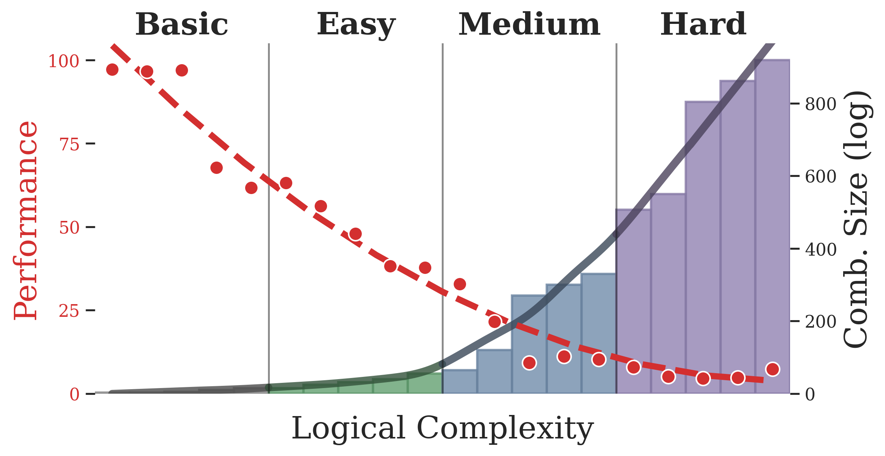

# SLR: An Automated Framework for Scalable Logical Reasoning in LLMs

> **Note:** The code is currently being cleaned up for public release. Installation and usage instructions will be finalized soon!

---

## Overview

**SLR** (*Scalable Logical Reasoning*) is an open-source end-to-end framework for the systematic evaluation and training of Large Language Models (LLMs) using scalable, curriculum-driven logical reasoning tasks. SLR (\metalogic) synthesizes inductive reasoning tasks at controlled difficulty, enabling automated creation of benchmarks and curricula—guaranteeing novelty, symbolic evaluation, and extensibility.

  

*Figure 1: Overview of the SLR framework. The pipeline comprises formal task specification, automated synthesis, training (SFT or RL), and deterministic symbolic evaluation.*

---

## Key Features

- **Automatic Task Generation:** SLR synthesizes new inductive logic programming (ILP) tasks with custom logic, controlled challenge levels, and natural language prompts.
- **Customizable & Scalable:** Users can specify their own logical vocabulary, grammar, and task configuration; the framework supports arbitrary task complexity.
- **Symbolic Evaluation:** Tasks are evaluated via symbolic execution—no dependence on MCQA, EM, LLM-based judges, or human annotation.
- **Curriculum Learning:** Train models on SRL-Bench increasing logical and combinatorial complexity.

---

## SLR-Bench: The Standard Benchmark Curriculum

We instantiate SLR as **SLR-Bench**, a 20-level curriculum benchmark with over 19,000 prompts. Each curriculum tier (basic, easy, medium, hard) builds in both logical and combinatorial complexity.

  

*Figure 2: SLR-Bench curriculum progression. Task complexity rises rapidly; model accuracy (red) declines with challenge, exposing current LLM weaknesses.*

---

## How It Works

### 1. **Task Specification**

Define a task language (vocabulary & grammar) and a task configuration:
- **Vocabulary:** Constants, predicates, functions
- **Grammar:** Constraints on meaningful atoms
- **Config:** Rule sampling policies, rule length, background sampling, number of positive/negative examples

### 2. **Task Synthesis**

An automated pipeline:
- **Rule Synthesis:** Generate a latent ground-truth rule.
- **Background Synthesis:** Build background atoms (facts) and create labeled examples via stratified sampling.
- **Label Assignment:** Determine which examples satisfy the target rule.
- **Prompt Creation:** Assemble human- and model-friendly instruction prompts.

See the main figure for full flow.

### 3. **Training & Evaluation**

- **Symbolic Judge:** Verifies hypotheses by running the candidate solution on all examples via logic execution.
- **Metrics:** Binary task passing, partial scoring, syntax check

### 4. **Logic-Tuning/Meta-Learning**

Enables both supervised fine-tuning (SFT) and RL-based approaches, with feedback from the symbolic judge guiding updates—improving logical reasoning from first principles.

## Main Results

Below is the leaderboard for various LLMs on SLR-Bench (full table in the paper):

  

*Reasoning LLMs outperform base LLMs on logical accuracy but incur much higher compute requirements. However, logic-tuning with SLR dramatically boosts performance for base models at low cost.*

---

## Example Task

Here is a sample prompt and target rule generated by SLR-Bench:

  

---

## Current Status & Roadmap

> **Code is under cleanup and will be released soon—stay tuned for the initial release and updates!**
>
> Planned features for first release:
> - Full SLR-Bench dataset (curriculum, splits, ground-truth, symbolic validator)
> - End-to-end ILP task synthesizer & judge
> - Examples for LLM evaluation & tuning
> - Documentation and extensibility templates

---

## Getting Started

<!-- **Coming soon!** Full installation and usage instructions (dataset generation, evaluation, training, and analyzing results) will appear here when the code is released. -->

## Citing

Coming soon! Please refer to the paper for citation details.